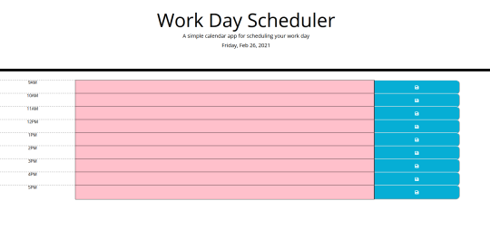

# Daily Scheduler in JavaScript
A simple daily planner to write events/tasks in, which saves the events to local storage. It also color-codes the hours of the day to indicate if they are in the past, present, or future.

## Usage
The event slots are text areas, and clicking on them allows for the input of text. The save button on the right side will store the text in local storage. The text is persistent, and the text areas are populated with stored text on page load.

## Screenshot
